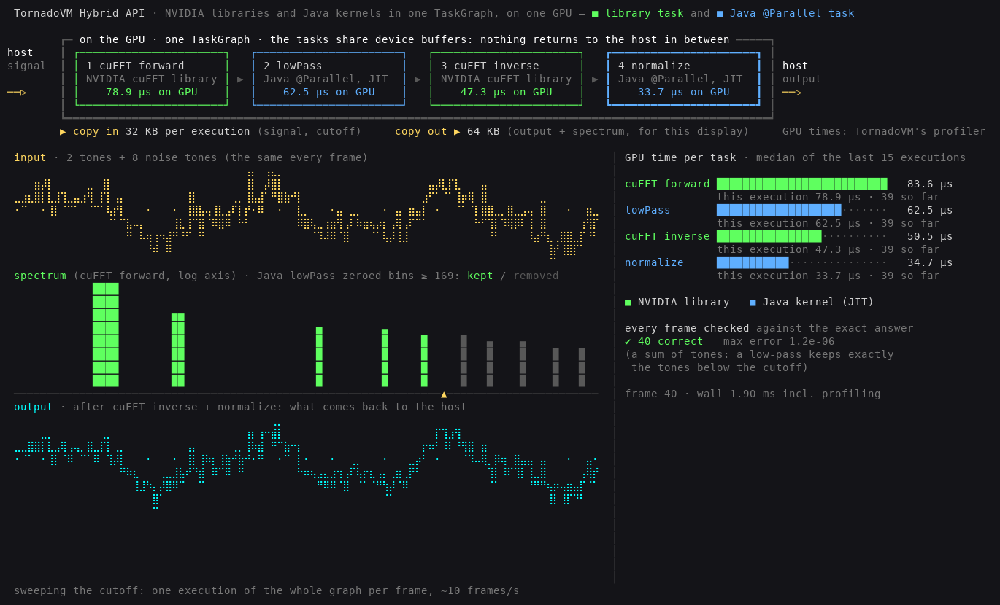

# 29 — The Hybrid API, live

**What it does, in short.** One TornadoVM `TaskGraph` runs four tasks on the GPU, alternating **NVIDIA cuFFT
library calls** with **Java methods that TornadoVM JIT-compiles to CUDA**. All four share device buffers, so nothing
returns to the host between them. The graph low-pass filters a noisy signal:

```
signal → 1 cuFFT forward (NVIDIA) → 2 lowPass (Java @Parallel) → 3 cuFFT inverse (NVIDIA) → 4 normalize (Java) → output
```

A full-screen dashboard runs the graph once per frame while the filter's cutoff sweeps down, so the noise drains out
of the signal live:
* each task's GPU time, from TornadoVM's own profiler;
* the bytes that cross PCIe;
* the input, the spectrum (kept and removed bins) and the output, with every frame checked against the exact answer;
* at the end, the same graph replayed as a CUDA graph.



## What does this demonstrate?

* **Library tasks and Java tasks are equals in one graph.** `libraryTask("forward", CuFft::cufftForwardR2C, …)`
  and `task("lowPass", HybridLive::lowPass, …)` sit side by side. The Java kernel works directly on cuFFT's output
  buffer, and cuFFT reads the Java kernel's output.
* **No host round trips.** The profiler shows 32 KB copied in (the signal, the cutoff) and 64 KB out (the output,
  plus the spectrum the dashboard draws) per execution. The intermediate buffers stay on the GPU.
* **It is correct, every frame.** The input is a sum of tones, so a low-pass keeps exactly the tones below the
  cutoff. Each of the 110 executions is compared with that exact answer (max error about 1e-6).
* **Capture once, replay.** The same graph with `withCUDAGraph()`: about 62 µs → 39 µs per execution (1.6×).

## What TornadoVM feature/API does it use?

* `TaskGraph.libraryTask` with `tornado-cufft` (`CuFft.cufftForwardR2C`, `CuFft.cufftInverseC2R`), mixed with
  `task(...)` on `@Parallel` Java methods.
* An `IntArray` parameter for the cutoff (`EVERY_EXECUTION`), so the sweep changes it without rebuilding the graph.
* `withProfiler(ProfilerMode.SILENT)` and `getProfileLog()`, for per-task `TASK_KERNEL_TIME` and the copy sizes.
* `withCUDAGraph()`.

## How do I run it?

```bash
source scripts/setup-env.sh
bash demos/29-hybrid-api-live/run.sh                    # the dashboard; [enter] at the end (NO_PAUSE=1 exits by itself)
bash demos/29-hybrid-api-live/run.sh plain tornado      # the program alone, its output lines and the verdict
bash demos/29-hybrid-api-live/run.sh plain java         # the same via java @argfile
```

The dashboard needs a terminal of at least 124 × 40 with 256 colors and Python 3. It is about 20 s.

## How do I validate the result?

The program prints `HybridLive: PASSED` only if every sweep execution and the CUDA-graph run match the exact
answer. The dashboard ends in `HybridDashboard: PASSED` on the same condition.

## What should the presenter point out?

* **The frame around the four boxes:** one graph, on the GPU, with green NVIDIA library tasks and blue Java
  tasks. The numbers in the boxes are measured GPU times.
* **The spectrum:** the yellow ▲ is the cutoff. The Java kernel zeroes everything right of it; the grey ghosts are
  what it removed. Watch the output turn into a clean tone.
* **The copy line:** only the input and the result cross PCIe.
* **The end:** the CUDA graph makes the whole four-task graph one launch, 1.6× faster.

The animation lights the boxes in execution order. Each task takes tens of microseconds, too short to watch, so
the light shows the order and the numbers show the measured times. The task bars are a rolling median of 15
executions, because the GPU clocks down between the paced frames.

## GPU/CUDA requirements

Any GPU TornadoVM 7.0.0's CUDA backend supports. cuFFT comes with the SDK's `tornado-cufft` module, through the
CUDA toolkit libraries the SDK already uses.

## Provenance

Captured on the sm_89 host: RTX 4090, driver 610.57.04, JDK 25.0.2, TornadoVM 7.0.0 (SDKMAN
`7.0.0-jdk22plus-cuda`). See `results/raw/50-hybrid-api-live/MANIFEST.md`.
